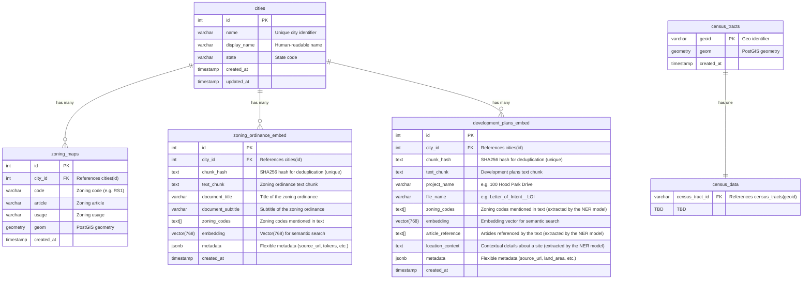

# AC215 Spatially Project

This is a project that will leverage LLM to create a spatially intelligent agent that can help real estate decisions.

## Database Schema



> **Note:** The `census_data` table schema is a placeholder. Please define the appropriate fields based on the census data requirements (e.g., demographics, housing statistics, economic indicators, etc.).

### Quick Start

```bash
docker compose -f docker-compose.yml up
```

If you only want to run the collector, you can run the following command
```bash
docker compose -f docker-compose.yml run --rm collector
```

If you only want to run the label studio, you can run the following command
```bash
docker compose -f docker-compose.yml run --rm label-studio
```

## References
1. NYC Zoning Webmap: https://zola.planning.nyc.gov/l/zoning-district/C5-P?search=false
2. ReZone (Keep in track of zoning changes): https://www.re-zone.ai/
3. TryMappr (Interactive zoning map): https://trymappr.com/

