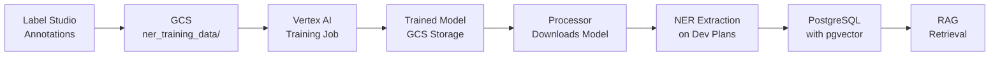

# Development Plans NER Model - Training & Deployment Summary

## Location of Training Artifacts

### 1. Training Scripts & Configuration Files

**Main Training Script:**

- `llm/development_plans/NER/package/trainer/train.py` (784 lines)
  - Main `Trainer` class with full training loop
  - Handles Label Studio annotation import from GCS
  - Implements smart text chunking for long documents
  - Uses class-weighted loss to handle imbalanced entity distribution

**Entry Point:**

- `llm/development_plans/NER/package/run/__main__.py`
  - CLI interface for training with arguments: `--batch-size`, `--epochs`, `--learning-rate`, `--model-name`

**Configuration Files:**

- `llm/development_plans/NER/package/config/labels.py`
  - Defines 7 base entity types: `CONSTRUCTION_DETAILS`, `PROPERTY_USAGE`, `ZONING_DISTRICT`, `ZONING_RELIEF`, `ARTICLE_REFERENCE`, `EXPECTED_IMPACT`, `LOCATION_CONTEXT`
  - Generates BIO tags (14 total labels + "O" for outside)
- `llm/development_plans/NER/pyproject.toml` & `package/setup.py`

**Vertex AI Job Configuration:**

- `workflow/jobs/finetune/development_plans_ner.py` - Defines Vertex AI training job
- `workflow/jobs/run_development_plans_ner.py` - CLI to submit training jobs
- `workflow/packages/config.py` - Package configuration for GCS upload

**Docker Configuration:**

- `llm/development_plans/NER/Dockerfile` - Local development image
- `docker-compose.yml` (lines 149-162) - Service definition for `llm_development_plans_trainer`

### 2. Dataset References (Versioned)

**Training Data Location:**

```
GCS Bucket: spatially-us-east1 (main data bucket)
Path: gs://{bucket}/development_plans/ner_training_data/
Format: Label Studio JSON exports (multiple files combined during training)
```

**Data Versioning Strategy:**

- Annotations are exported from Label Studio as JSON files
- Files are uploaded to GCS path: `development_plans/ner_training_data/`
- Each training run pulls all files from this path and combines them
- Versioning is implicit through GCS object versioning and WandB run tracking

### 3. Experiment Logs

**Weights & Biases (WandB) Tracking:**

- Project: `spatially-development-plans-ner`
- Dashboard: https://wandb.ai
- Framework: HuggingFace Transformers
- Model artifacts logged to WandB + saved to GCS

**Model Storage:**

- GCS Bucket: `spatially-us-central-1-model-training`
- Path: `gs://{bucket}/ner_model_output/model/`
- Local: `tmp/ner_model/` and `tmp/ner_tokenizer/`

## Key Results & Model Performance

### Training Configuration

```yaml
Model: nlpaueb/legal-bert-base-uncased
Batch Size: 4
Epochs: 5
Learning Rate: 2e-5 (0.00002)
Device: CUDA (GPU)
Optimizer: AdamW
Loss: Class-weighted CrossEntropyLoss (O=0.1, entities=1.0)
```

### Dataset

```yaml
Data Source: GCS (development_plans/ner_training_data/)
Total Examples: 390 (after downsampling)
Training Set: 351 examples (90%)
Validation Set: 39 examples (10%)
Downsampling: 15% of NO_ENTITIES chunks kept
Labels: 15 classes (7 entity types × 2 BIO tags + "O")
```

### Training Results

```yaml
Training Time: 224 seconds (~3.7 minutes)
Total Steps: 440
Final Train Loss: 0.5907
Final Validation Loss: 0.8698
Token Val Accuracy: 78.5%
```

### Framework & Infrastructure

```yaml
Python: 3.10.15
HuggingFace Transformers: 4.39.3
WandB: 0.15.11
Platform: linux-x86_64
Model Size: ~420MB
Memory: ~2GB RAM
Inference: 20-50ms (GPU), 100-200ms (CPU)
```

## Deployment Strategy & Integration

### Deployment Architecture

**Model Serving:**

```
GCS Storage → Local Cache → PyTorch Inference (CPU/GPU/MPS)
```

**Integration Point:**

- `data/processor/development_plans/ner_json_processor.py`
  - Loads model from GCS on initialization
  - Caches locally for faster subsequent loads
  - Uses `NERPredictor` class for inference

### Inference Pipeline

**1. Model Loading (data/processor initialization):**

```python
from predictor import NERPredictor

predictor = NERPredictor(
    gcp_storage=storage,
    gcp_project=project_id,
    model_gcs_path="ner_model_output/model/ner_model",
    tokenizer_gcs_path="ner_model_output/model/ner_tokenizer",
    model_bucket="spatially-us-central-1-model-training",
    device=None  # Auto-detect (CUDA > MPS > CPU)
)
```

**2. Entity Extraction (per chunk):**

```python
entities = predictor.predict_entities(text)
# Returns: [{"text": "...", "label": "ZONING_RELIEF", "start": 42, "end": 58, "confidence": 0.95}, ...]
```

**3. Database Storage:**

- Extracted entities are stored in `development_plans_embed` table:
  - `zoning_codes`: Extracted from ZONING_DISTRICT entities
  - `article_reference`: From ARTICLE_REFERENCE entities
  - `location_context`: From LOCATION_CONTEXT entities
  - All entities stored in JSONB metadata for RAG retrieval

### Deployment Workflow



**Steps:**

1. **Annotation:** Label data in Label Studio (http://localhost:8080)
2. **Export:** Export annotations to GCS (`development_plans/ner_training_data/`)
3. **Package:** Upload trainer package: `python packages/run.py --packages ner-trainer`
4. **Train:** Submit Vertex AI job: `python jobs/run_development_plans_ner.py --epochs 5`
5. **Deploy:** Model automatically available at GCS path
6. **Process:** Run processor: `python data/processor/development_plans/run.py --city boston`
